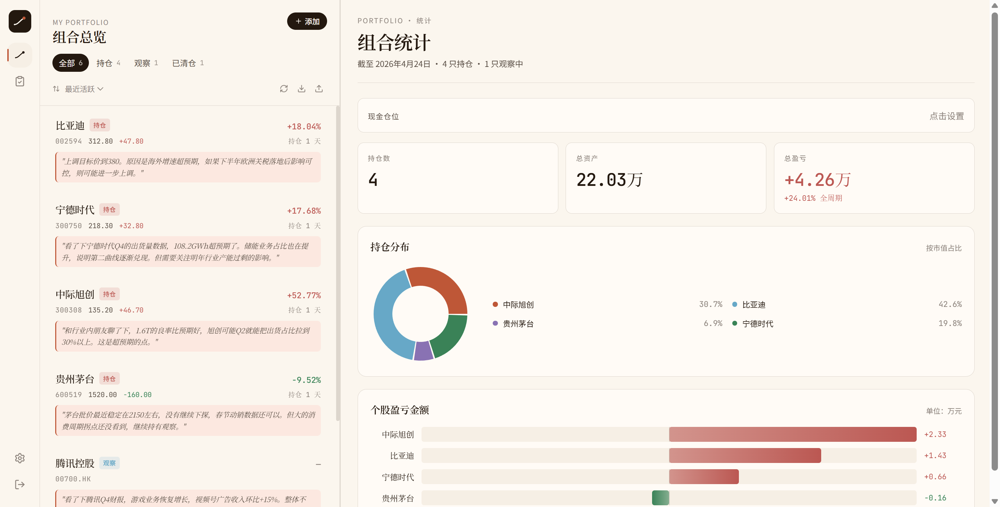

# Follow — 投资思考记录与复盘工具

> 记录你的投资思考，而不只是交易记录。

Follow 是一个面向 A 股 + 港股个人投资者的研究与持仓管理工具。核心理念是**沉淀投资过程中的判断与思考**——不是又一个盯盘软件，而是帮你回答"当时我在想什么"这个问题。



## 为什么做这个？

市面上不缺行情工具和交易记录软件，但很少有工具专注于投资过程中的**思考沉淀**。

好的投资决策依赖持续的认知迭代，而大多数人的思考散落在微信、备忘录、Excel 里，很难在事后复盘时还原。Follow 把每一只股票的研究逻辑、关键追踪指标、每一次判断和修正都结构化地记录下来，让你在回头看时能清晰地还原决策链路。

## 核心功能

### 组合总览

一目了然地管理所有持仓、观察中和已清仓的股票。

- 持仓/观察/已清仓三种状态筛选，支持按盈亏、活跃度、名称排序
- A 股 + 港股实时行情自动刷新（交易时间内自动获取，非交易时间不请求）
- 总市值、总盈亏、持仓分布饼图、个股盈亏柱状图
- 数据导入导出（JSON 备份），一键迁移

### 个股研究卡片

每只股票的核心研究页面，沉淀你的投资逻辑。

- **研究摘要**：投资逻辑、看好理由、风险点，以及成本价、现价、持仓数量、盈亏金额和持仓市值
- **关键追踪锚**：替代传统止盈止损线。每个锚 = 指标名称 + 预期值 + 追踪频率 + 最新实际值。比如"季度出货量 > 50 万台"、"毛利率 > 25%"——用基本面数据驱动决策
- **思考时间线**：按时间排列的判断记录，支持思考、买入、卖出、修正判断、纪律执行五种类型标签，可按类型筛选


### 阶段复盘

定期回顾你的操作和思考质量，不只是看盈亏数字。

- **判断记分卡**：回顾选定时间段内的买入、卖出、调仓操作，逐条标记"判断正确 / 待验证 / 判断错误"，统计兑现率
- **操作纪律审计**：记录频率热力图（GitHub 风格）、追踪锚更新率、逾期未更新提醒
- **复盘笔记**：自由文本记录阶段性总结，按时间段存档


### 行情数据

- A 股 + 港股实时价格（腾讯财经 API，无需 Key）
- 添加股票时输入代码自动识别名称（支持 6 位 A 股代码和 5 位港股代码）
- 交易时间内页面加载自动刷新，也可手动刷新
- 清仓时自动生成盈亏快照记录

## 技术栈

| 层级 | 技术 |
|------|------|
| 前端 | React + Vite + Tailwind CSS v4 |
| 后端 | Supabase（PostgreSQL + Auth + RLS） |
| 图表 | Recharts |
| 行情 | 腾讯财经 API（A 股 + 港股） |
| 部署 | Vercel |

## 本地开发

```bash
# 安装依赖
npm install

# 配置环境变量
cp .env.example .env
# 填入你的 Supabase URL 和 anon key

# 启动开发服务器
npm run dev
```

需要在 `.env` 中配置：
```
VITE_SUPABASE_URL=your_supabase_url
VITE_SUPABASE_ANON_KEY=your_supabase_anon_key
```

## License

MIT
