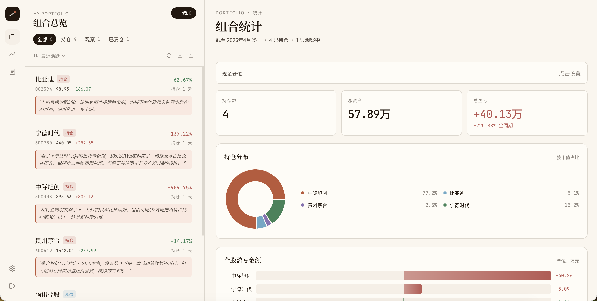
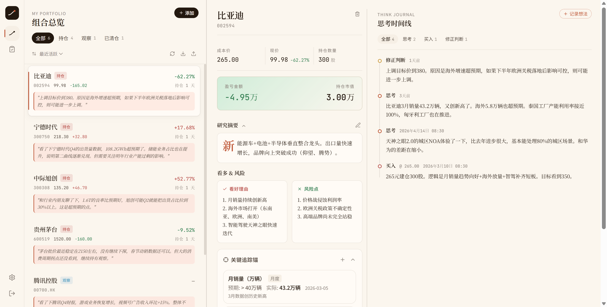
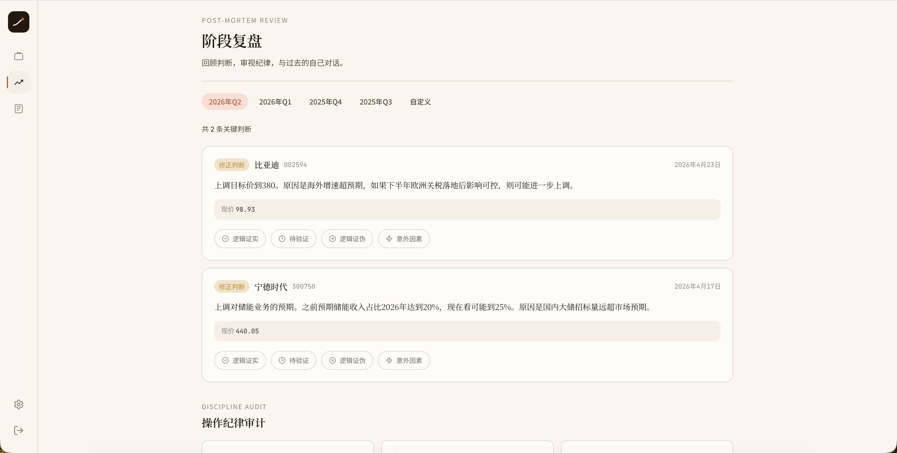

# FollowMind — 投资思考记录与复盘工具

> 跟随一颗思考的心。记录你的投资思考，而不只是交易记录。

FollowMind 是一个面向 A 股 + 港股个人投资者的研究与持仓管理工具。核心理念是**沉淀投资过程中的判断与思考**——不是又一个盯盘软件，而是帮你回答"当时我在想什么"这个问题。

## 为什么做这个？

市面上不缺行情工具和交易记录软件，但很少有工具专注于投资过程中的**思考沉淀**。

好的投资决策依赖持续的认知迭代，而大多数人的思考散落在微信、备忘录、Excel 里，很难在事后复盘时还原。FollowMind 把每一只股票的研究逻辑、关键追踪指标、每一次判断和修正都结构化地记录下来，让你在回头看时能清晰地还原决策链路。

## 核心功能

### 组合总览

一目了然地管理所有持仓、观察中和已清仓的股票。

- 持仓/观察/已清仓三种状态筛选，支持按盈亏、活跃度、名称排序
- A 股 + 港股实时行情自动刷新（交易时间内自动获取，非交易时间不请求）
- 现金仓位追踪、总资产统计、持仓分布甜甜圈图、个股盈亏柱状图
- 迷你走势图（Sparkline）展示近期价格趋势
- 数据导入导出（JSON 备份），一键迁移



### 个股研究卡片

每只股票的核心研究页面，沉淀你的投资逻辑。

- **研究摘要**：投资逻辑（首字下沉排版）、看好理由与风险点双栏对比、成本价、现价、持仓数量、盈亏 callout 卡片
- **关键追踪锚**：替代传统止盈止损线。每个锚 = 指标名称 + 预期值 + 追踪频率 + 最新实际值。比如"季度出货量 > 50 万台"、"毛利率 > 25%"——用基本面数据驱动决策
- **思考时间线**：按时间排列的判断记录，支持思考、买入、卖出、修正判断、纪律执行五种类型标签，可按类型筛选
- **快照存证**：记录想法时一键保存当前价格和盈亏数据
- **逻辑标签**：#宏观驱动 #基本面反转 #情绪博弈 #套利 + 自定义标签



### 阶段复盘

定期回顾你的操作和思考质量，不只是看盈亏数字。

- **判断记分卡**：回顾选定时间段内的买入、卖出、调仓操作，逐条标记"判断正确 / 待验证 / 判断错误"，统计兑现率
- **操作纪律审计**：记录频率热力图（GitHub 风格）、追踪锚更新率、逾期未更新提醒
- **复盘笔记**：自由文本记录阶段性总结，按时间段存档



### 设计系统

- **三套主题**：Warm Paper（暖纸，默认）/ Midnight Journal（夜间）/ Kraft Card（牛皮纸），支持一键切换
- **排版**：Noto Serif SC 衬线标题 + Noto Sans SC 正文 + JetBrains Mono 数字
- **配色**：oklch 色彩空间，红涨绿跌（柔和色调，非正红正绿）
- **Logo**：Arc Dot 标志——一条弧线 + 两点，代表趋势追踪与思考记录

## 技术栈

| 层级 | 技术 |
|------|------|
| 前端 | React 19 + Vite 8 + Tailwind CSS v4 |
| 后端 | Supabase（PostgreSQL + Auth + RLS） |
| 图表 | Recharts（甜甜圈图）+ 纯 CSS（盈亏柱状图） |
| 行情 | 腾讯财经 API（A 股 + 港股） |
| 字体 | Noto Serif SC + Noto Sans SC + JetBrains Mono |
| 桌面 | Tauri（可选，支持本地 SQLite 存储） |
| 部署 | Vercel |

## 本地开发

```bash
# 安装依赖
npm install

# 配置环境变量
cp .env.example .env
# 填入你的 Supabase URL 和 anon key

# 启动开发服务器
npm run dev
```

需要在 `.env` 中配置：
```
VITE_SUPABASE_URL=your_supabase_url
VITE_SUPABASE_ANON_KEY=your_supabase_anon_key
```

## License

AGPL-3.0 — 详见 [LICENSE](LICENSE) 文件。

简单来说：你可以自由使用和修改本项目，但修改后的版本必须同样开源并保持 AGPL-3.0 协议。商业授权请联系作者。
